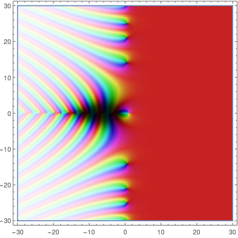
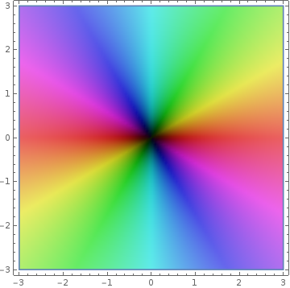

# DomainColourPlot (DCP)

[Domain Colouring](https://en.wikipedia.org/wiki/Domain_coloring) is a tool for
plotting complex functions by assigning each complex number a unique colour.

DCP uses the following colouring functions, which are hard coded into the
package:
```
hue = arg(z) / (2 * pi)
saturation = 1/(1 + .3 log(1 + abs(z)))
brightness = 1 - 1 / (1.1 + 5 log (1 + abs(z)))
```

`DomainColourPlot[Zeta, {-30,30}, {-30,30}]` produces:



`DomainColourPlot[Function[z,z^2], {-3,3}, {-3,3}]` produces:



## Usage:

```
DomainColourPlot[func, {-xMin, xMax}, {-yMin, yMax}]
```

Options:
1. AspectRatio: Controlled the ratio of the output diagram. By default, it is
	equal to (yMax - yMin) / (xMax - xMin)
2. PlotPoints: Number of samples
3. ImageSize: Same as Mathematica.
4. ImagePadding: Same as Mathematica
6. Frame: Same as Mathematica.
